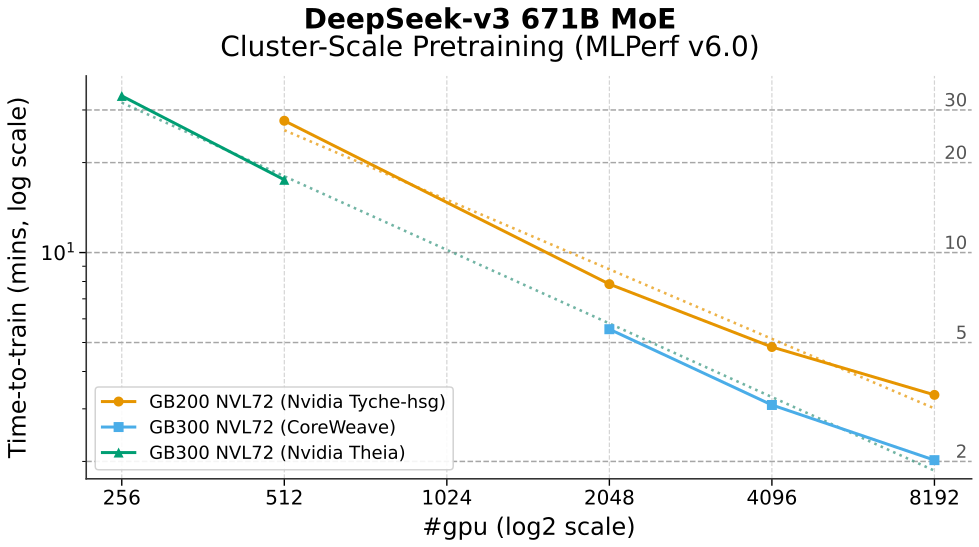
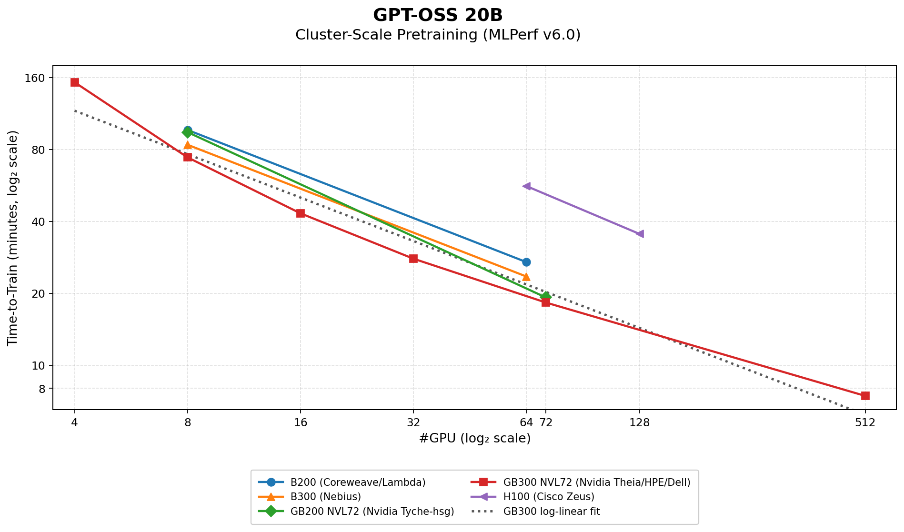
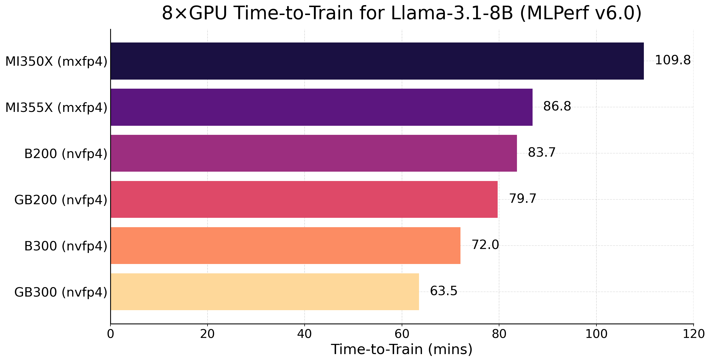

### Quick Rundown of MLPerf v6.0 Training
— 2026/06/18 

MLPerf Training v6.0 was released on June 16, 2026. MLCommons and participating companies have already published their own highlights, results, and platform narratives. This rundown is not meant to re-summarize those announcements. Instead, it adds analysis on the parts I care about as an observer:
* The new MoE pretraining workloads, *DeepSeek-v3 (671B)* and *GPT-OSS (20B)*, including notable optimization choices and configs.
* Scaling efficiency across GB200 and GB300 platforms. MI Instinct does not yet have enough data points for scaling analysis, but kudos for its first multi-node training submissions across MI300X, MI325X, and MI350X.
* Debut of AMD MXFP4 recipe submissions, enabling MXFP4/NVFP4 recipe comparisons on 8-GPU Llama 3.1 8B across B200, B300, GB200, GB300, MI350X, and MI355X.

Links:
* [v6.0 Release][v6-rl-mlcommons] by MLCommons, Supplemental Discussion [pdf][v6-supplement]
* [Result Dashboard][v6-tableau], [Submitters' code][gh-results]
* Nvidia: [blog][nv-blog], [tech dive][nv-tech]
* AMD: [blog][amd-blog], [tech dive][amd-tech], [tutorials][amd-repro]
* [Coreweave][cw-blog], [Nebius][nbs-blog], [Lambda][lmbd-blog], [Azure][azure-blog]
* My rundown on previous [v5.1 (Nov'25)][vs9-t5.1]

---
### DeepSeek-v3 (671B)

* DeepSeek-v3 (DSv3) is a new pretraining workload in v6.0, bringing Mixture-of-Expert (MoE) model family into the benchmark. It is also the largest workload by parameter count 671B.
* Briefly, DSv3 is the base model behind DeepSeek-R1, the DeepSeek's flagship reasoning model that triggered a major market reaction in early 2025. While Google pioneered large-scale MoE earlier, DSv3 arguably brought MoE into the mainstream for open-weight frontier models.
* More on how MLCommons integrates DSv3 for benchmarking [here][ref-dsv3], especially around how a 50-step trained checkpoint circumvents the high load imbalance and variance during early training.
* Given its sheer size, DeepSeek-v3 is a cluster-scale benchmark. NVIDIA and CoreWeave submitted results across a wide range of GPU counts, allowing us to estimate scaling efficiency for GB200 NVL72 and GB300 NVL72. 
* **Scaling Efficiency: 85.5% on GB200, 88.2% on GB300, solid strong-scaling overall.** [See][supp-dsv3] how we fit log-linear and arrive at estimated efficiency.
* **Fastest result**: 8,192 GB300 gpus took only 2.021 mins to train DSv3 for 3+B tokens. Key configs: MXFP8 recipe including attention on top typical linear, full-iteration cuda-graph, EP communication using [HybridEP][hybridep-blog] and overlapping it via 1F1B PP schedule. See official technical [highlights][nv-tech] and discussion at depth in [this][mcore-moe-report] technical report.
* **Worth noting**: Nvidia tech blog [previews][nv-tech-nemo2606] another ~1.3× training throughput uplift in NeMo 26.06 via full stack codesign on GB300. *Could translate time-to-train under 2 mins with 8K GB300? will revisit this once the NeMo 26.06 image and relevant release notes are available.*

---

### GPT-OSS (20B)

* GPT-OSS 20B is another MoE workload introduced in v6.0, with accessibility as the main goal, it is benchmarkable with as little as a single 8-GPU node. Unlike DSv3, GPT-OSS does not start from a pretrained checkpoint. Instead, the benchmark recipe [tunes][ref-gpt-oss] hyperparameters of Adam and weight initialization to bound routing variance and improve benchmarking fairness.
* How to arrive at the plot above? 41 entries, so pruning and deduplication are needed for readability. Entries are first grouped by GPU model, then deduplicated by GPU count. The legend shows the submitter combination behind each series.
* Although GPT-OSS 20B was benchmarked on GB300 across a wide range of GPU counts, we do not report scaling efficiency here. Based on our [analysis][supp-gpt-oss], the runs are not a clean strong- or weak-scaling study, each scale point uses different global batch size and parallelism mapping, taking uneven number of gradient updates, as well as number of tokens to converge. The relative ordering between gpu type still make sense.
* Just a thought: the GB300 curve shows visible curvature at higher scale. For example, the 32-GPU and 512-GPU runs use the same GBS and converge in the same number of steps, but the time-to-train speedup is only 3.9×, far below the ideal 16× from scaling 32 → 512 GPUs. My suspicion (1) EP comm overhead of EP=8 in 512x case while DP-only in 32x case; (2) gradient-reduce collectives of the 512-GPU case can become increasingly exposed, i.e. DP=64 and thin MBS=1.
* It is interesting to observe EP is only turned on at >72xGB200/300, 64xB200/300. *TODO: deeper analysis*

---
### MXFP4 vs NVFP4 (Llama3.1 8B on 8 x GPUs)

| Metric                |  MI350X |  MI355X |   B200 |  GB200 |   B300 |  GB300 |
|-----------------------|--------:|--------:|-------:|-------:|-------:|-------:|
| Precision             |   MXFP4 |   MXFP4 |  NVFP4 |  NVFP4 |  NVFP4 |  NVFP4 |
| Base LR               |    1e-3 |    8e-4 |   4e-4 |   4e-4 | 4.4e-4 |   4e-4 |
| Grad Accum            |       2 |       2 |      1 |      1 |      1 |      1 |
| GBS                   |      32 |      32 |     16 |     16 |     16 |     16 |
| Steps to converge     |    5760 |    5760 |  11520 |  11520 |  10752 |  10752 |
| # Trained Tokens (B)  |    1.51 |    1.51 |   1.51 |   1.51 |   1.41 |   1.41 |
| Avg Step Time (ms)    |     535 |     431 |    415 |    413 |    384 |    330 |
| Time-to-train (mins)  |   109.8 |    86.8 |   83.7 |   79.7 |   72.0 |   63.5 |

Datasheet: [MI355X][mi355x-datasheet], [MI350X][mi350x-datasheet], [B200][b200-datasheet], [GB200][gb200-datasheet], [B300][b300-datasheet], [GB300][gb300-datasheet]

* Contributed by AMD, training in native MXFP4 has made its debut into benchmark this time round. This completes current-generation FP4 coverage in the benchmark across the two main FP4 formats: MXFP4 and NVFP4.
* Quick recap: MXFP4 quantizes every 32 elements using a power-of-two FP8 (e8m0) scale, while NVFP4 uses 16-element groups with FP8 (e4e3) scales. Both use FP4 (e2m1) as the quantized datatype. More discussion and references [here][vs9-fp4].
* From an observer's perspective, the interesting comparison is training recipe design around mxfp4 and nvfp4, and what that reveals about the observed training performance. Llama 3.1 8B is the best candidate because it has the most complete 8-GPU coverage. The plot above is constructed by filtering 68 entries down to 8-GPU submissions and selecting the best time-to-train for each GPU type.
* *More notes coming.*
<!--  -->

[v6-rl-mlcommons]: https://mlcommons.org/2026/06/mlperf-training-v6-0-results/
[v6-supplement]: https://mlcommons.org/wp-content/uploads/2026/06/MLPerf-Training-v6.0-Supplemental-Discussion-UNDER-EMBARGO-UNTIL-6_16_26-8_00-AM-PT-1.pdf
[v6-tableau]: https://mlcommons.org/benchmarks/training/
[gh-results]: https://github.com/mlcommons/training_results_v6.0

[nv-blog]: https://blogs.nvidia.com/blog/blackwell-mlperf-training-6-0/
[nv-tech]: https://developer.nvidia.com/blog/nvidia-blackwell-tops-mlperf-training-6-0-with-industry-leading-scale-and-performance/
[nv-tech-nemo2606]: https://developer.nvidia.com/blog/nvidia-blackwell-tops-mlperf-training-6-0-with-industry-leading-scale-and-performance/#continuous_full-stack_co-design_sum_of_all_the_parts
[mcore-moe-report]: https://arxiv.org/abs/2603.07685
[hybridep-blog]: https://developer.nvidia.com/blog/optimizing-communication-for-mixture-of-experts-training-with-hybrid-expert-parallel/

[amd-blog]: https://www.amd.com/en/blogs/2026/amd-delivers-breakthrough-mlperf-training-6-0-results.html
[amd-tech]: https://rocm.blogs.amd.com/artificial-intelligence/mlperf-training-v6.0/README.html
[amd-repro]: https://rocm.blogs.amd.com/artificial-intelligence/mlperf-training6.0-repro/README.html
[amd-mxfp4-paper]: https://arxiv.org/abs/2605.09825

[cw-blog]: https://www.coreweave.com/blog/coreweave-trains-deepseek-v3-in-two-minutes
[nbs-blog]: https://nebius.com/blog/posts/mlperf-training-v6-0-results
[lmbd-blog]: https://lambda.ai/blog/mlperf-training-v6.0-lambda-delivers-fastest-llm-training
[azure-blog]: https://techcommunity.microsoft.com/blog/azurehighperformancecomputingblog/azure-sets-a-new-performance-record-for-llm-training-benchmark-at-extreme-scale/4523077

[vs9-t5.1]: https://github.com/vuiseng9/mlperf-t5.1-rundown
[vs9-fp4]: https://github.com/vuiseng9/fp4-training

[ref-gpt-oss]: https://mlcommons.org/2026/05/gpt-oss-moe-training6
[ref-dsv3]: https://mlcommons.org/2026/05/deepseek-v3-training-v6-0

[supp-gpt-oss]: ./supplement-gptoss.md
[supp-dsv3]: ./supplement-dsv3.md

[mi355x-datasheet]: https://www.amd.com/content/dam/amd/en/documents/instinct-tech-docs/product-briefs/amd-instinct-mi355x-gpu-brochure.pdf
[mi350x-datasheet]: https://www.amd.com/content/dam/amd/en/documents/instinct-tech-docs/product-briefs/amd-instinct-mi350x-gpu-brochure.pdf
[b300-datasheet]: https://resources.nvidia.com/en-us-dgx-systems/dgx-b300-datasheet
[b200-datasheet]: https://resources.nvidia.com/en-us-dgx-systems/dgx-b200-datasheet
[gb200-datasheet]: https://resources.nvidia.com/en-us-dgx-systems/dgx-superpod-gb200-datasheet
[gb300-datasheet]: https://resources.nvidia.com/en-us-dgx-systems/dgx-gb300-datasheet

